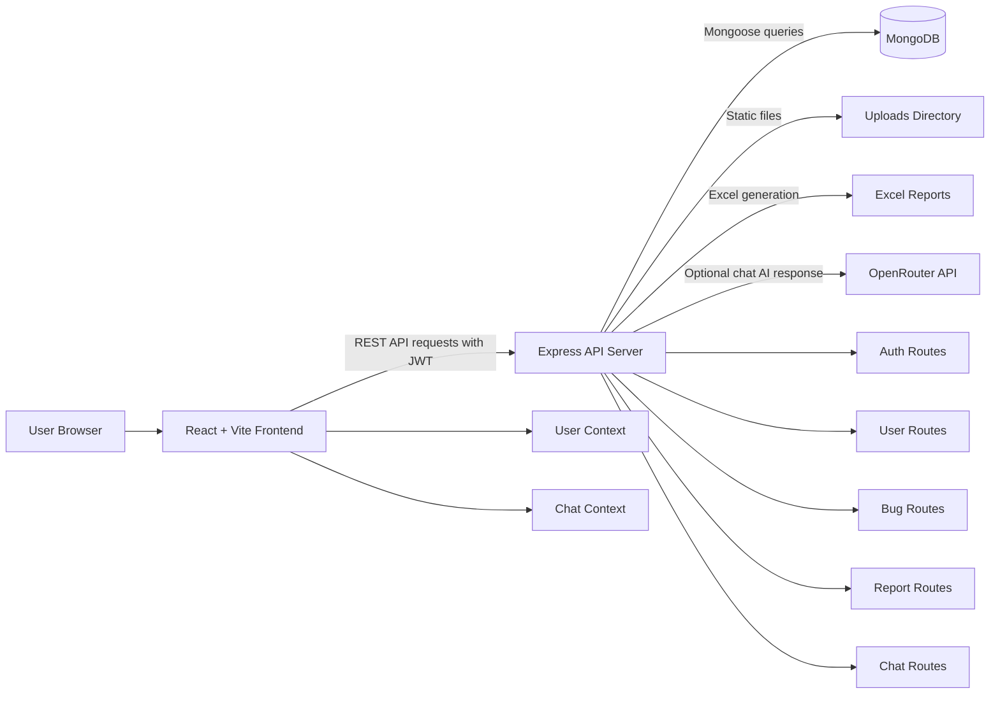
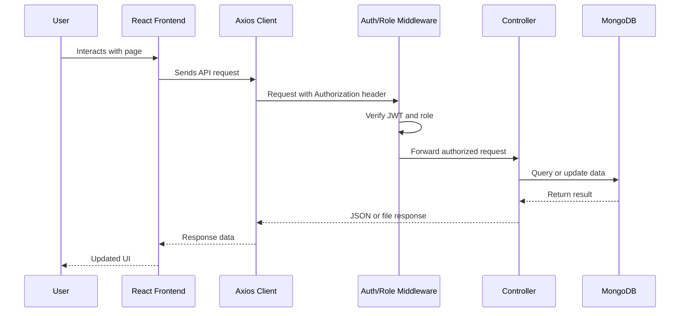
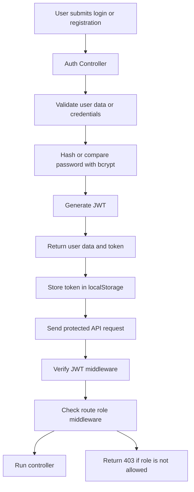
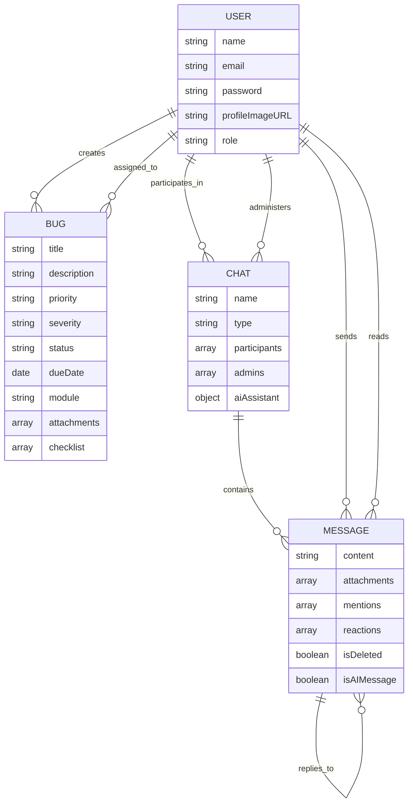
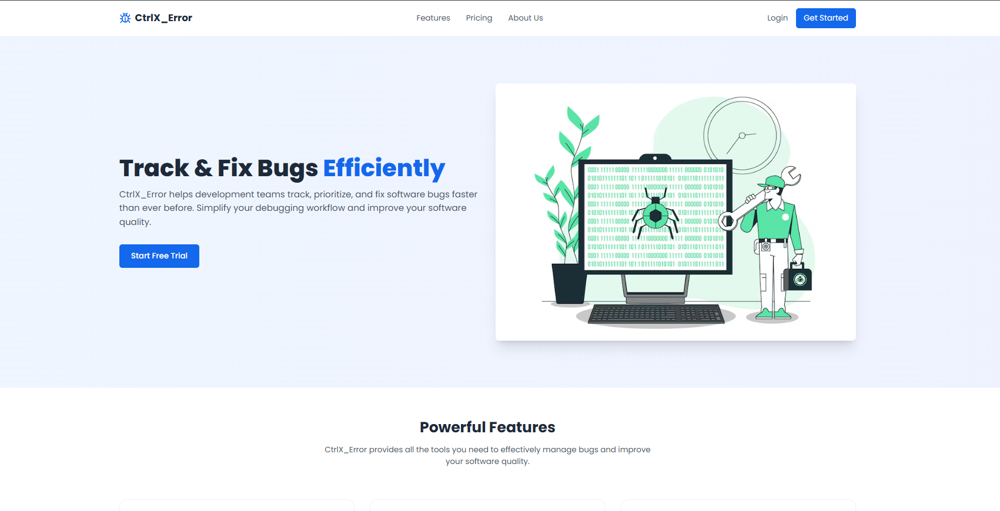
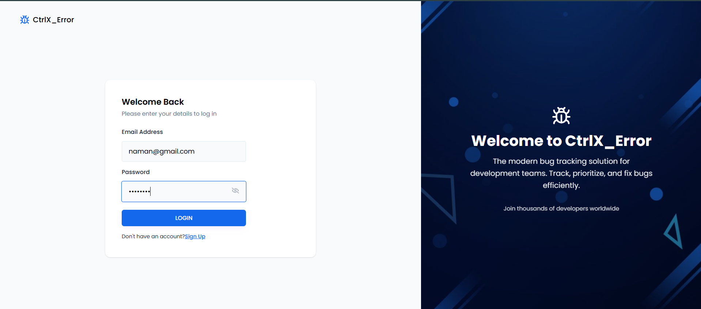
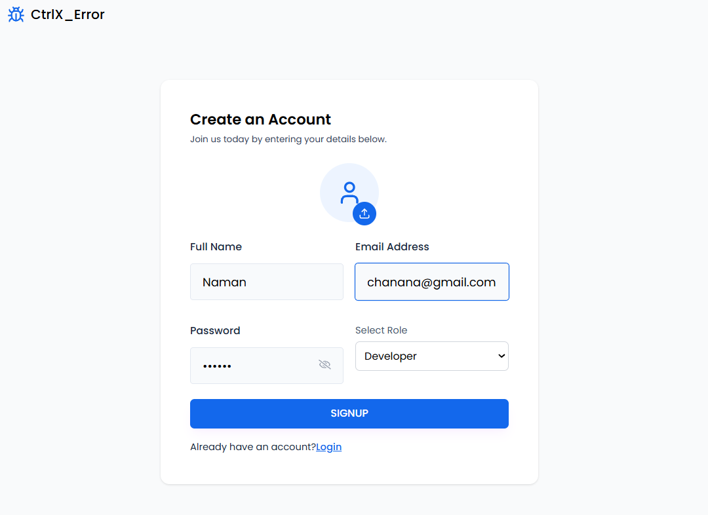

# CtrlX_Error

CtrlX_Error is a full-stack bug tracking application built with React, Node.js, Express, and MongoDB. It provides role-based workflows for administrators, testers, and developers to report, view, assign, update, and track software bugs.

---

# CtrlX_Error

[](https://ctrl-x-error.vercel.app/)
[](https://www.figma.com/design/wF8zt2Kh5jmG3qMGbCKIPv/Smriti?node-id=0-1)
[](LICENSE)


---

## Table of Contents

- [Project Overview](#project-overview)
- [Key Features](#key-features)
- [Tech Stack](#tech-stack)
- [Repository Structure](#repository-structure)
- [System Architecture](#system-architecture)
- [Frontend Architecture](#frontend-architecture)
- [Backend Architecture](#backend-architecture)
- [Request Lifecycle](#request-lifecycle)
- [Authentication & Authorization](#authentication--authorization)
- [Database](#database)
- [API Overview](#api-overview)
- [Installation](#installation)
- [Environment Variables](#environment-variables)
- [Configuration](#configuration)
- [Error Handling](#error-handling)
- [Security](#security)
- [Screenshots](#screenshots)
- [Future Improvements](#future-improvements)
- [Contributing](#contributing)
- [License](#license)
- [Authors](#authors)

---

## Project Overview

CtrlX_Error is designed to support software issue management through separate workflows for testers, developers, and administrators.

The application allows testers to report bugs, developers to review assigned bugs and update progress, and administrators to monitor bug activity, manage users, manage bugs, and export reports.

The motivation behind the project is to provide a structured system for tracking bugs across a development workflow, including assignment, status tracking, checklist progress, dashboards, reports, and team communication.

Intended users:

- Administrators who manage users, bugs, dashboards, and exports.
- Testers who report and review bugs they created.
- Developers who work on assigned bugs and update status/checklist progress.

---

## Key Features

### Authentication and User Access

- User registration.
- User login.
- JWT-based authentication.
- Password hashing with bcrypt.
- Authenticated user profile retrieval.
- Authenticated profile update.
- Role selection during signup.
- Admin registration protected by an invite token.

### Role-Based Workflows

- Admin dashboard and management views.
- Tester dashboard and bug reporting views.
- Developer dashboard and assigned bug views.
- Frontend route protection by role.
- Backend route protection by role.

### Bug Management

- Tester-created bug reports.
- Bug listing with role-based visibility.
- Bug detail views.
- Bug update support.
- Admin bug deletion.
- Developer assigned bug list.
- Developer checklist updates.
- Developer bug status updates.
- Bug status summary counts.
- Bug dashboard statistics by role.

### Bug Data Fields

- Title.
- Description.
- Priority: `Low`, `Medium`, `High`.
- Severity: `Minor`, `Major`, `Critical`.
- Status: `Open`, `In Progress`, `Closed`.
- Due date.
- Module.
- Created by user.
- Assigned developers.
- Attachments as stored links/paths.
- Checklist items.
- Update history field in the schema.

### Dashboards and Visualization

- Admin dashboard statistics.
- Tester dashboard statistics.
- Developer dashboard statistics.
- Bug status distribution charts.
- Bug priority/severity chart components.
- Recent bug tables.

### Reports

- Excel export for bug reports.
- Excel export for user/bug summary reports.

### Chat

- Create chats.
- List chats for the current user.
- View chat details.
- Update chat settings by chat admin.
- Delete chats by chat admin.
- Send messages.
- Paginated message retrieval.
- Message read tracking.
- Chat participants and chat admins.
- Chat attachment upload route.
- Optional AI assistant response support through OpenRouter.

### Frontend UI

- Landing page.
- Login and signup pages.
- Role-specific dashboards.
- Bug cards and bug tables.
- Reusable modals.
- Reusable form inputs.
- Charts built with Recharts.
- Toast notifications.
- Responsive dashboard navigation.

---

## Tech Stack

| Area | Technologies |
| --- | --- |
| Frontend | React 19, React DOM, React Router DOM, Tailwind CSS |
| Backend | Node.js, Express 5 |
| Database | MongoDB, Mongoose |
| Authentication | JWT, bcryptjs |
| APIs | REST APIs with Express routes and Axios clients |
| State Management | React Context API for user and chat state |
| Build Tools | Vite, ESLint, Nodemon |
| Other Libraries | Recharts, Moment, date-fns, React Icons, React Hot Toast, Multer, ExcelJS, dotenv, cors, Axios, Vercel Speed Insights |

---

## Repository Structure

```text
CtrlX_Error/
├── README.md
├── backend/
│   ├── config/
│   │   └── db.js
│   ├── controllers/
│   │   ├── authController.js
│   │   ├── bugController.js
│   │   ├── chatController.js
│   │   ├── reportController.js
│   │   └── userController.js
│   ├── middlewares/
│   │   ├── auth.js
│   │   ├── authmiddleware.js
│   │   └── uploadMiddleware.js
│   ├── models/
│   │   ├── Bug.js
│   │   ├── Chat.js
│   │   ├── Message.js
│   │   └── User.js
│   ├── routes/
│   │   ├── authRoutes.js
│   │   ├── bugRoutes.js
│   │   ├── chatRoutes.js
│   │   ├── reportRoutes.js
│   │   └── userRoutes.js
│   ├── services/
│   │   └── aiService.js
│   ├── uploads/
│   ├── package.json
│   └── server.js
├── docs/
└── frontend/
    ├── public/
    ├── src/
    │   ├── assets/
    │   ├── components/
    │   │   ├── Cards/
    │   │   ├── Charts/
    │   │   ├── Inputs/
    │   │   ├── chat/
    │   │   └── layouts/
    │   ├── context/
    │   ├── hooks/
    │   ├── pages/
    │   │   ├── Admin/
    │   │   ├── Auth/
    │   │   ├── Developer/
    │   │   └── Tester/
    │   ├── routes/
    │   ├── utils/
    │   ├── App.jsx
    │   ├── index.css
    │   └── main.jsx
    ├── eslint.config.js
    ├── index.html
    ├── package.json
    ├── vercel.json
    └── vite.config.js
```

### Major Directory Purposes

| Directory | Purpose |
| --- | --- |
| `backend/` | Express API server, database models, controllers, middleware, routes, services, and uploads. |
| `backend/config/` | MongoDB connection setup. |
| `backend/controllers/` | Request handling and application business logic. |
| `backend/middlewares/` | JWT verification, role authorization, and file upload handling. |
| `backend/models/` | Mongoose schemas and models. |
| `backend/routes/` | API route definitions grouped by module. |
| `backend/services/` | External service integration, currently OpenRouter AI response handling. |
| `backend/uploads/` | Uploaded files served through the backend. |
| `frontend/` | React/Vite single-page application. |
| `frontend/public/` | Public static assets. |
| `frontend/src/assets/` | Application images. |
| `frontend/src/components/` | Reusable UI, chart, input, layout, and chat components. |
| `frontend/src/context/` | React Context providers for user and chat state. |
| `frontend/src/hooks/` | Custom React hooks. |
| `frontend/src/pages/` | Route-level pages grouped by user role. |
| `frontend/src/routes/` | Private route guard. |
| `frontend/src/utils/` | API paths, Axios configuration, utility functions, upload helper, and menu data. |
| `docs/` | Project documents in PDF and spreadsheet formats. |

---

## System Architecture

CtrlX_Error uses a client-server architecture.

The frontend is a React single-page application. It manages authentication state, chat state, protected routes, UI rendering, form submission, and API communication.

The backend is an Express API server. It handles authentication, authorization, bug operations, user operations, report exports, chat operations, file uploads, and AI assistant integration.

MongoDB stores users, bugs, chats, and messages through Mongoose models.



---

## Frontend Architecture

The frontend is organized as a Vite React application.

### Entry Point

- `src/main.jsx` mounts the React application.
- `UserProvider` supplies authenticated user state.
- `ChatProvider` supplies chat state.
- `SpeedInsights` is included for Vercel Speed Insights.

### Routing

Routes are defined in `src/App.jsx` with `react-router-dom`.

Public routes:

- `/landing`
- `/login`
- `/signup`
- `/`

Admin routes:

- `/admin/dashboard`
- `/admin/bugs`
- `/admin/bugs/:id`
- `/admin/users`
- `/admin/create-bug`
- `/admin/chats`

Tester routes:

- `/tester/dashboard`
- `/tester/report-bug`
- `/tester/bug/:id`
- `/tester/my-bugs`
- `/tester/all-bugs`
- `/tester/chats`

Developer routes:

- `/developer/dashboard`
- `/developer/assigned-bugs`
- `/developer/update-bugs`
- `/developer/assigned-bugs/:id`
- `/developer/chats`

### Pages

Pages are grouped by role under `src/pages/`:

- `Auth/`: Login and signup.
- `Admin/`: Admin dashboard, bug management, user management, admin bug view.
- `Tester/`: Tester dashboard, bug creation, bug lists, bug details.
- `Developer/`: Developer dashboard, assigned bugs, status updates, assigned bug details.
- `ChatPage.jsx`: Shared chat page used by all roles.
- `LandingPage.jsx`: Public landing page.

### Components

Reusable components are grouped by responsibility:

- `Cards/`: Bug, info, and user cards.
- `Charts/`: Recharts-based bar and pie charts.
- `Inputs/`: Form inputs, selectors, user assignment, checklist, and attachment inputs.
- `layouts/`: Auth layout, dashboard layout, navbar, side menu.
- `chat/`: Chat sidebar, messages, input, create modal, settings modal.

### State Management

The frontend uses React Context:

- `UserContext` manages authenticated user, token loading, user updates, and logout cleanup.
- `ChatContext` manages chat list, active chat, messages, chat loading states, errors, pagination, creation, updates, deletion, and sending messages.

### API Communication

- `utils/axiosInstance.js` defines a shared Axios client using `http://localhost:8000`.
- The Axios request interceptor attaches `Authorization: Bearer <token>` from `localStorage`.
- The Axios response interceptor handles `401` responses by clearing the token and redirecting to `/login`.
- `utils/apiPaths.js` centralizes most API paths.
- `ChatContext` uses a separate Axios client with `import.meta.env.VITE_API_URL || "http://localhost:8000/api"`.

---

## Backend Architecture

The backend is an Express application using ES modules.

### Routes

Routes are grouped by feature:

- `authRoutes.js`: Registration, login, profile, image upload.
- `userRoutes.js`: User listing, developer listing, user lookup.
- `bugRoutes.js`: Bug dashboards, bug CRUD, assigned bugs, status updates, checklist updates.
- `reportRoutes.js`: Excel report exports.
- `chatRoutes.js`: Chat and message operations.

### Controllers

Controllers contain request handling logic:

- `authController.js`: User registration, login, token generation, profile retrieval, profile update.
- `userController.js`: User lists, user lookup, developer lookup.
- `bugController.js`: Bug lifecycle, dashboards, role-filtered queries, status/checklist updates.
- `reportController.js`: Excel workbook generation for bugs and users.
- `chatController.js`: Chat CRUD, message CRUD, pagination, read tracking, AI assistant response handling.

### Middleware

- `authmiddleware.js`: Main JWT protection and role-based middleware.
- `auth.js`: JWT verification middleware used by chat routes.
- `uploadMiddleware.js`: Image upload middleware for profile images.

### Models

- `User`: User account and role data.
- `Bug`: Bug details, assignment, checklist, attachments, status, and update history.
- `Chat`: Chat metadata, participants, admins, AI assistant settings.
- `Message`: Chat messages, attachments, mentions, replies, reactions, read tracking.

### Services

- `aiService.js`: Formats chat messages and calls OpenRouter for optional AI assistant responses.

### Utilities

- Backend utility logic is contained in route/controller/service files.
- MongoDB connection is handled by `config/db.js`.
- Static file serving is configured in `server.js` for `/uploads`.

```mermaid
flowchart TB
    Server[server.js]
    Server --> Routes[Routes]
    Server --> DB[config/db.js]
    Server --> StaticUploads[/uploads static serving]

    Routes --> AuthRoutes[authRoutes]
    Routes --> UserRoutes[userRoutes]
    Routes --> BugRoutes[bugRoutes]
    Routes --> ReportRoutes[reportRoutes]
    Routes --> ChatRoutes[chatRoutes]

    AuthRoutes --> AuthController[authController]
    UserRoutes --> UserController[userController]
    BugRoutes --> BugController[bugController]
    ReportRoutes --> ReportController[reportController]
    ChatRoutes --> ChatController[chatController]

    Routes --> Middleware[Auth and Role Middleware]
    AuthRoutes --> UploadMiddleware[uploadMiddleware]
    ChatRoutes --> ChatUpload[Multer chat uploads]

    AuthController --> UserModel[User Model]
    UserController --> UserModel
    UserController --> BugModel[Bug Model]
    BugController --> BugModel
    ReportController --> BugModel
    ReportController --> UserModel
    ChatController --> ChatModel[Chat Model]
    ChatController --> MessageModel[Message Model]
    ChatController --> UserModel
    ChatController --> AIService[aiService]
```

---

## Request Lifecycle

An authenticated API request follows this flow:

1. The user interacts with a React page or component.
2. The frontend sends an Axios request to the backend.
3. The JWT token is attached as a `Bearer` token.
4. Backend authentication middleware verifies the token.
5. Role middleware checks access where configured.
6. The route calls the appropriate controller.
7. The controller performs validation and business logic.
8. Mongoose reads or writes MongoDB documents.
9. The backend returns JSON or a file response.
10. The frontend updates state and renders the result.



---

## Authentication & Authorization

Authentication uses JWT.

During login or registration, the backend returns a signed JWT with a `7d` expiry. The frontend stores the token in `localStorage`. Authenticated API requests include the token in the `Authorization` header.

Passwords are hashed with bcrypt before storage.

Authorization is role-based. Supported roles are:

- `admin`
- `tester`
- `developer`

Backend authorization middleware includes:

- `adminOnly`
- `testerOnly`
- `developerOnly`
- `authorizeRoles(...roles)`

Frontend authorization is handled through `PrivateRoute`, which checks the current user and allowed roles before rendering protected routes.



---

## Database

The application uses MongoDB with Mongoose.

### Models

| Model | Purpose |
| --- | --- |
| `User` | Stores user account details, hashed password, profile image URL, and role. |
| `Bug` | Stores bug information, assigned developers, creator, checklist, status, attachments, and update history. |
| `Chat` | Stores chat metadata, participants, admins, last message, and AI assistant configuration. |
| `Message` | Stores chat messages, sender, attachments, mentions, replies, reactions, deletion state, AI flag, and read tracking. |

### Relationships

- A `Bug` references a `User` through `createdBy`.
- A `Bug` references one or more assigned `User` documents through `assignedTo`.
- A `Chat` references users through `participants` and `admins`.
- A `Chat` references a `Message` through `lastMessage`.
- A `Message` references a `Chat`.
- A `Message` references a `User` through `sender`, `mentions`, `reactions.user`, and `readBy.user`.
- A `Message` can reference another `Message` through `replyTo`.

### Persistence Flow

Data is persisted by controllers using Mongoose models. The backend connects to MongoDB during server startup through `connectDB()` in `backend/config/db.js`.



---

## API Overview

### Auth APIs

| Method | Endpoint | Access | Purpose |
| --- | --- | --- | --- |
| `POST` | `/api/auth/register` | Public | Register a user. |
| `POST` | `/api/auth/login` | Public | Authenticate a user and return a token. |
| `GET` | `/api/auth/profile` | Private | Get current user profile. |
| `PUT` | `/api/auth/profile` | Private | Update current user profile. |
| `POST` | `/api/auth/upload-image` | Public in route definition | Upload a profile image. |

### User APIs

| Method | Endpoint | Access | Purpose |
| --- | --- | --- | --- |
| `GET` | `/api/users` | Admin | Get all users with bug stats. |
| `GET` | `/api/users/developers` | Admin, Tester | Get all developers. |
| `GET` | `/api/users/:id` | Private | Get user by ID. |

### Bug APIs

| Method | Endpoint | Access | Purpose |
| --- | --- | --- | --- |
| `GET` | `/api/bugs/admin-dashboard` | Admin | Get admin dashboard data. |
| `GET` | `/api/bugs/tester-dashboard` | Tester | Get tester dashboard data. |
| `GET` | `/api/bugs/developer-dashboard` | Developer | Get developer dashboard data. |
| `GET` | `/api/bugs` | Private | Get role-filtered bugs. |
| `GET` | `/api/bugs/all-viewable` | Private | Get bugs visible to current user. |
| `GET` | `/api/bugs/user/:userId` | Private | Get bugs created by a user. |
| `GET` | `/api/bugs/assigned` | Developer | Get bugs assigned to current developer. |
| `GET` | `/api/bugs/:id` | Private | Get bug by ID. |
| `POST` | `/api/bugs` | Tester | Create a bug. |
| `PUT` | `/api/bugs/:id` | Private | Update a bug. |
| `DELETE` | `/api/bugs/:id` | Admin | Delete a bug. |
| `PUT` | `/api/bugs/:id/status` | Developer | Update bug status. |
| `PUT` | `/api/bugs/:id/checklist` | Developer | Update bug checklist. |

### Report APIs

| Method | Endpoint | Access | Purpose |
| --- | --- | --- | --- |
| `GET` | `/api/reports/export/bugs` | Admin | Export bug report as Excel. |
| `GET` | `/api/reports/export/users` | Admin | Export user report as Excel. |

### Chat APIs

All chat routes require JWT verification.

| Method | Endpoint | Purpose |
| --- | --- | --- |
| `POST` | `/api/chats` | Create a chat. |
| `GET` | `/api/chats` | Get chats for current user. |
| `GET` | `/api/chats/:id` | Get chat by ID. |
| `PUT` | `/api/chats/:id` | Update chat settings. |
| `DELETE` | `/api/chats/:id` | Delete a chat. |
| `POST` | `/api/chats/:id/messages` | Send a message. |
| `GET` | `/api/chats/:id/messages` | Get paginated messages. |

---

## Installation

### Prerequisites

- Node.js
- npm
- MongoDB database connection string

### Clone

```bash
git clone <repository-url>
cd CtrlX_Error
```

### Install Backend Dependencies

```bash
cd backend
npm install
```

### Install Frontend Dependencies

```bash
cd ../frontend
npm install
```

### Environment Variables

Create a `.env` file in the `backend/` directory.

```env
PORT=8000
MONGO_URI=mongodb://localhost:27017/bugtracker
JWT_SECRET=your_jwt_secret
ADMIN_INVITE_TOKEN=your_admin_invite_token
OPENROUTER_API_KEY=your_openrouter_api_key
APPLICATION_URL=http://localhost:5000
```

If using the chat frontend with a non-default backend URL, configure the frontend environment with:

```env
VITE_API_URL=http://localhost:8000/api
```

### Run Backend

Development mode:

```bash
cd backend
npm run dev
```

Production start command:

```bash
cd backend
npm start
```

### Run Frontend

Development mode:

```bash
cd frontend
npm run dev
```

Production build:

```bash
cd frontend
npm run build
```

Preview production build locally:

```bash
cd frontend
npm run preview
```

---

## Environment Variables

| Variable | Used By | Required For | Purpose |
| --- | --- | --- | --- |
| `PORT` | Backend | Server startup | Defines the backend server port. |
| `MONGO_URI` | Backend | Database connection | MongoDB connection string. |
| `JWT_SECRET` | Backend | Authentication | Secret used to sign and verify JWTs. |
| `ADMIN_INVITE_TOKEN` | Backend | Admin registration | Token required to register an admin user. |
| `OPENROUTER_API_KEY` | Backend | Chat AI assistant | API key for OpenRouter integration. |
| `APPLICATION_URL` | Backend | OpenRouter request headers | Referer value sent to OpenRouter; defaults in code if not set. |
| `VITE_API_URL` | Frontend | Chat API client | Base API URL used by `ChatContext`; defaults to `http://localhost:8000/api`. |

---

## Configuration

| File | Purpose |
| --- | --- |
| `backend/package.json` | Backend scripts and dependencies. |
| `backend/server.js` | Express app setup, CORS, JSON parsing, route mounting, uploads static serving, server start. |
| `backend/config/db.js` | MongoDB connection setup. |
| `frontend/package.json` | Frontend scripts and dependencies. |
| `frontend/vite.config.js` | Vite, React, Tailwind plugin setup, build output, source map, and dev server settings. |
| `frontend/eslint.config.js` | ESLint configuration for JavaScript and JSX files. |
| `frontend/vercel.json` | Vercel SPA rewrite configuration to route all paths to `index.html`. |
| `frontend/src/utils/axiosInstance.js` | Shared Axios base URL, timeout, request interceptor, and response interceptor. |
| `frontend/src/utils/apiPaths.js` | Centralized frontend API path definitions. |

---

## Error Handling

Backend controllers use `try/catch` blocks and return JSON error responses with HTTP status codes such as `400`, `401`, `403`, `404`, and `500`.

Examples of handled errors include:

- Duplicate user registration.
- Invalid login credentials.
- Missing or invalid JWT token.
- Unauthorized role access.
- Missing bug fields.
- Invalid priority or severity values.
- Missing bug or chat records.
- Invalid chat IDs.
- Failed report exports.
- Failed AI assistant responses.

Frontend error handling includes:

- Axios response interception for `401` responses.
- Console logging for API errors.
- Toast notifications in multiple bug, dashboard, report, and chat flows.
- Local form validation in login, signup, and bug creation pages.
- Loading states in dashboards, bug views, and chat views.

No centralized backend error-handling middleware was found in the repository analysis.

---

## Security

Implemented security mechanisms:

- Password hashing with bcrypt before user storage.
- JWT-based authentication.
- Auth middleware for protected backend routes.
- Role-based authorization middleware.
- Frontend private route protection by role.
- Admin registration requires `ADMIN_INVITE_TOKEN`.
- MongoDB user queries exclude passwords in profile/user-fetch paths.
- Image upload middleware for profile images restricts MIME types to JPEG/JPG/PNG.

Security considerations found during repository analysis:

- CORS is configured with `origin: "*"`.
- Tokens are stored in `localStorage`.
- `/api/auth/upload-image` is not protected in the route definition.
- Chat attachment uploads do not define file type or size restrictions in the route.
- No rate limiting middleware was found.
- No centralized input sanitization middleware was found.

---

## Screenshots


### Landing Page



### Authentication



<br>


### Admin Dashboard


### Tester Workflow

Placeholder for tester bug reporting and bug list screenshots.

### Developer Workflow

Placeholder for assigned bugs and status update screenshots.

### Chat

Placeholder for chat interface screenshot.

---

## Future Improvements

These improvements are based on the current repository architecture and observed gaps:

- Add automated backend tests.
- Add automated frontend tests.
- Add centralized backend error-handling middleware.
- Add request validation middleware for API boundaries.
- Align frontend status names with backend status values.
- Consolidate duplicate authentication middleware files.
- Protect the profile image upload route.
- Add file size and type validation for chat attachments.
- Make frontend API base URLs consistently configurable.
- Add pagination for bug list endpoints.
- Add backend deployment configuration.
- Add API documentation generated from actual backend routes.
- Add seed or setup instructions for creating initial users.

---

## Contributing

Contributions are welcome through issues and pull requests.

Recommended workflow:

1. Fork the repository.
2. Create a feature branch.
3. Install backend and frontend dependencies.
4. Make changes in the relevant package.
5. Run available lint/build commands.
6. Verify role-based flows affected by the change.
7. Open a pull request with a clear description of the change.

Contribution guidelines:

- Keep backend routes, controllers, models, and middleware separated by responsibility.
- Keep frontend pages role-specific and shared UI in `components/`.
- Do not document features that are not implemented.
- Keep API paths synchronized between backend routes and `frontend/src/utils/apiPaths.js`.
- Avoid introducing new status values unless backend schema and frontend views are updated together.

---

## License

This project is licensed under the GNU General Public License v3.0.

See the LICENSE file for details.

---

## Authors

Project contributors preserved from the repository documentation:

| Contributor | Role | Contributions |
| --- | --- | --- |
| Soumya Jain | Frontend Developer | UI design, React pages, Figma design. |
| Smriti Walia | QA & Research | Bug testing, UI layout, documentation. |
| Amulya Jain | Integration & DevOps | Frontend-backend integration, fixes, middleware, versioning. |
| Naman Chanana | Backend & Full-Stack Lead | Auth, email, database design, API testing. |

Additional contributors can be added here as the project evolves.
